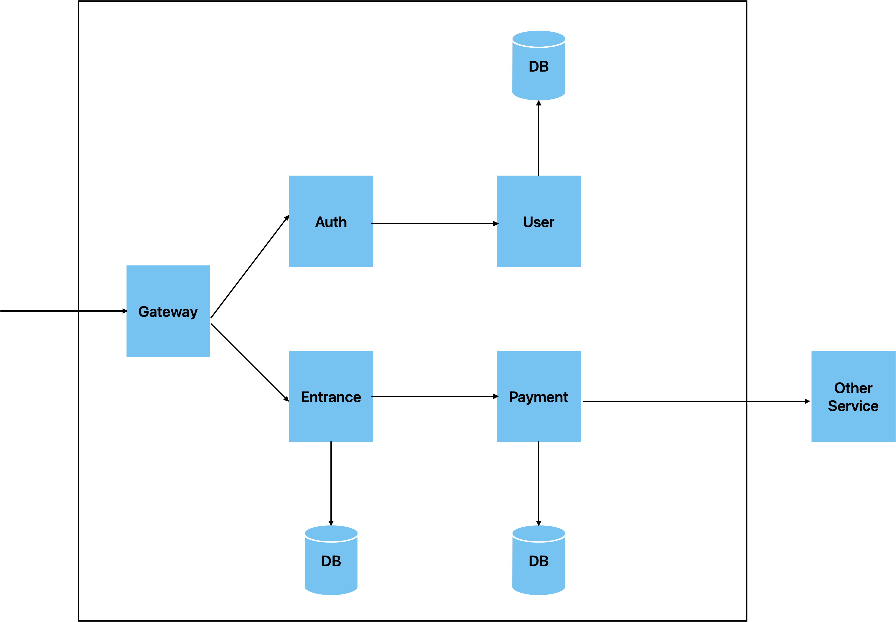

# gRPC　＋　Go　でつくるmicroservicesなREST API

## 概要

本リポジトリは、Zenn書籍の「Go言語でgRPCでつくるREST API開発 2024年版」のサンプルリポジトリです。
誤字脱字、訂正依頼等ございましたら、こちらのIssueまでお願いいたします。

## 構成



## 実行方法

```bash
docker compose up -d
```

## 完成環境

## 参考

## ライセンス

MIT LICENCE
