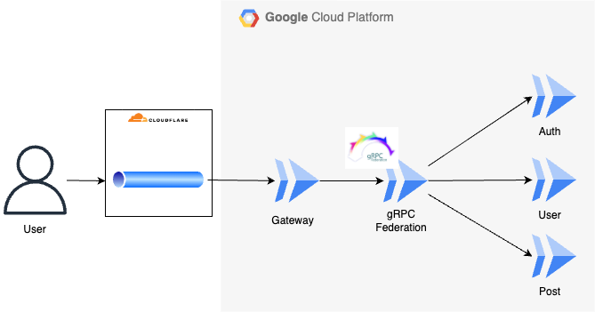

# gRPC　＋　Go　でつくるmicroservicesな API

[](https://github.com/o-ga09/microservice-go-api/actions/workflows/lint_and_test.yml)

## 概要

本リポジトリは、Zenn書籍の「Go言語でgRPCでつくるREST API開発 2024年版」のサンプルリポジトリです。
誤字脱字、訂正依頼等ございましたら、こちらのIssueまでお願いいたします。

## 構成



## 実行方法

```bash
docker compose up -d
```

## 完成環境

## 参考

## ライセンス

MIT LICENCE
